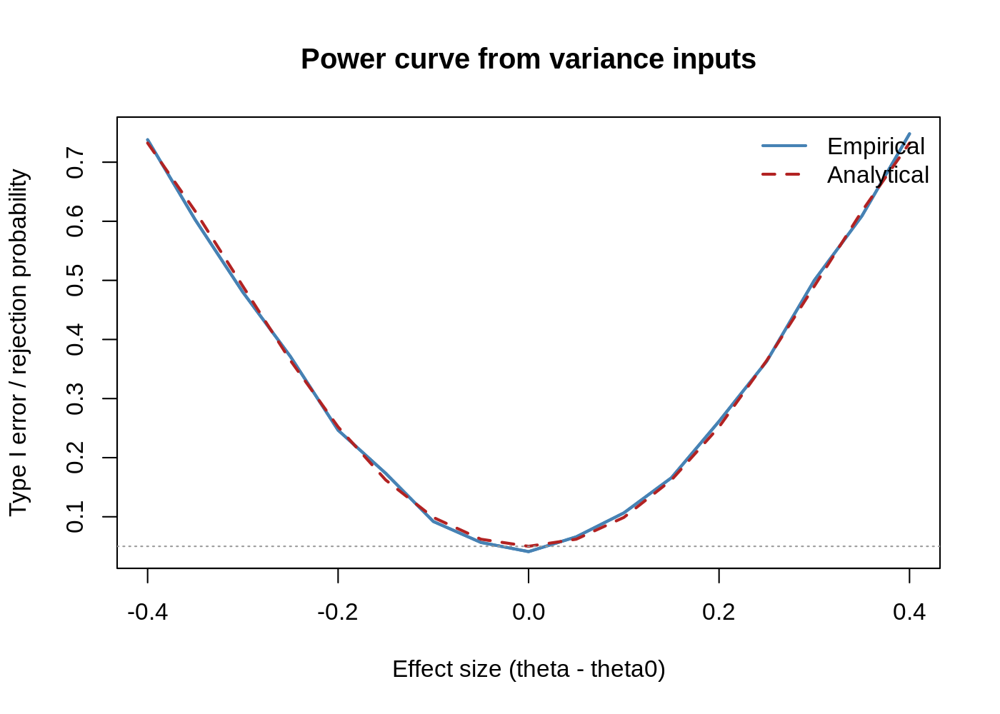
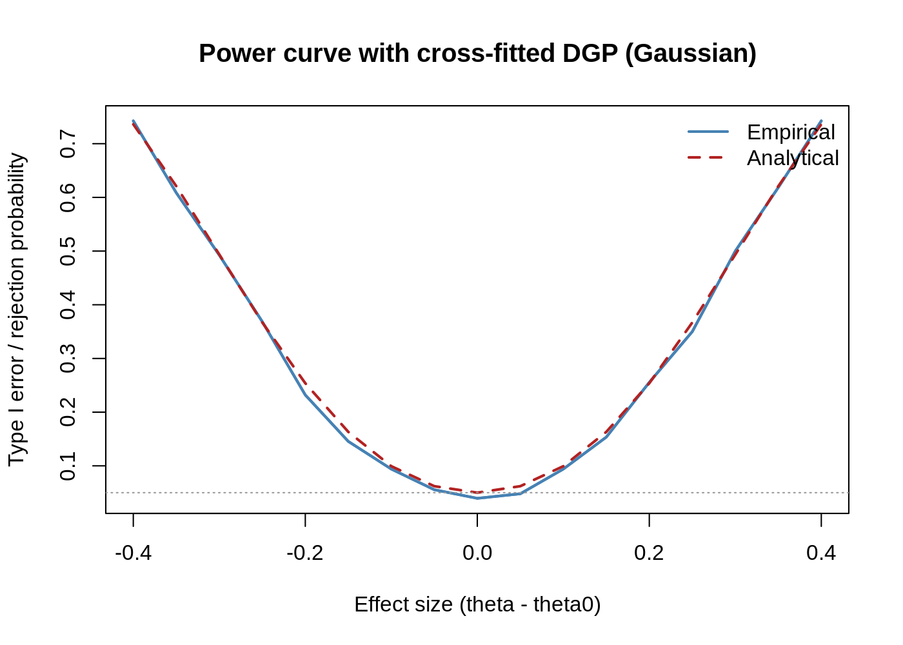

<!-- README.md is generated from README.Rmd. Please edit that file -->

# pppower

<!-- badges: start -->

[](https://github.com/yiqunchen/pppower/actions/workflows/R-CMD-check.yaml)
<!-- badges: end -->

The goal of `pppower` is to conduct power analysis based on the
Prediction-Powered Inference (PPI) framework. It is a convenient tools
for planning and evaluating studies with PPI estimators. The package
provides analytical formulas, Monte Carlo estimators, plotting helpers,
and sample-size solvers for both mean estimation and linear regression
(PPI-OLS) workflows.

## Installation

You can install the development version of `pppower` from
[GitHub](https://github.com/) with:

``` r
# install.packages("devtools")
devtools::install_github("yiqunchen/pppower")
```

## Example

This is a basic example which shows you how to solve a common problem:

``` r
library(pppower)
## basic example code
set.seed(1)
```

**Start with a cross-fitted superpopulation data**

``` r
# Linear signal with coefficients 0.3, 0.8, ... and heavier Gaussian noise (sd = 2)
# Cross-fitted predictions (out-of-fold)
df <- simulate_crossfit_data(
  n = 3500, p = 5, family = gaussian(), #
  K = 5, seed = 20251007
)
str(df)
#> 'data.frame':    3500 obs. of  7 variables:
#>  $ y      : num  -8.604 -0.121 2.387 1.222 1.246 ...
#>  $ x1     : num  -0.597 -0.215 0.678 1.876 -0.864 ...
#>  $ x2     : num  -0.156 0.543 -0.109 1.033 -1.44 ...
#>  $ x3     : num  -0.3061 0.6888 -0.2761 -0.0526 -0.4471 ...
#>  $ x4     : num  -1.192 -1.491 0.62 -0.268 0.453 ...
#>  $ x5     : num  -1.508 1.196 0.64 0.307 0.343 ...
#>  $ fhat_cf: num  -6.303 1.39 2.356 1.509 -0.385 ...
#>  - attr(*, "family")= chr "gaussian"
#>  - attr(*, "K")= num 5
```

`simulate_crossfit_data()` builds a synthetic “superpopulation” with
covariates, outcomes, and out-of-fold predictions (`fhat_cf`). These
serve as inputs for both analytical formulas and Monte Carlo power
simulations.

**Mean-estimation toolkit**

#### Analytical power and Monte Carlo calibration

``` r
theta_true <- mean(df$y)
theta0     <- theta_true - 0.35
delta      <- theta_true - theta0
var_f      <- var(df$fhat_cf)
var_res    <- var(df$y - df$fhat_cf)
N          <- 3000
n          <- 200
alpha      <- 0.05
sim        <- 2000

power_ppi_mean(delta, var_f, var_res, N, n, alpha)
#> [1] 0.6169984

simulate_power(
  delta   = delta,
  N       = N,
  n       = n,
  alpha   = alpha,
  var_f   = var_f,
  var_res = var_res,
  R       = sim
)
#>     Exact_PP Empirical_PP 
#>    0.6169984    0.6055000
```

- `power_ppi_mean()` returns the exact normal-theory power.
- `simulate_power()` confirms the formula empirically for any variance
  inputs.

#### Monte Carlo with an explicit superpopulation

``` r
mc_pp <- pppower:::simulate_power_ppi_mean(
  df      = df,
  N       = N,
  n       = n,
  alpha   = alpha,
  R       = sim,
  theta0  = theta0,
  seed    = 20251007
)
mc_pp$empirical_power
#> [1] 0.61
mc_pp$analytical_power
#> [1] 0.6169984
```

#### Sample-size planning

``` r
n_mean <- n_required_PP(
  delta   = delta,
  N       = N,
  alpha   = alpha,
  power   = 0.8,
  type    = "mean",
  var_f   = var_f,
  var_res = var_res
)
n_mean
#> [1] 340
```

`n_required_PP()` now supports the PP mean, PP-OLS, and custom variance
decompositions through the type switch (logistic regression in the
future).

**Linear Regression**

``` r
fit_ols <- ppi_ols_fit(
  y      = "y",
  f_col  = "fhat_cf",
  formula = ~ x1 + x2 + x3 + x4 + x5,
  data_l = df[1:n, ],
  data_u = df[(n + 1):(n + N), ]
)

summary(fit_ols)
#>               Estimate Std.Error          z     Pr...z..
#> (Intercept) -0.0582027 0.1342167 -0.4336473 6.645446e-01
#> x1           0.2154943 0.1492191  1.4441473 1.486975e-01
#> x2           0.9815688 0.1251441  7.8435075 4.381330e-15
#> x3           1.3205945 0.1195599 11.0454653 2.305700e-28
#> x4           1.9493006 0.1307634 14.9070810 2.964310e-50
#> x5           2.3846676 0.1275478 18.6962608 5.310028e-78

pieces      <- fit_ols$pieces
coef_names  <- colnames(pieces$V_u)       # matches V_u/V_l dimension
c_vec       <- numeric(length(coef_names))
names(c_vec) <- coef_names
c_vec["x1"] <- 1

delta_ols <- sum(c_vec * fit_ols$coef)
```

`ppi_ols_fit()` returns coefficient estimates, sandwich covariance, and
the $V_u$, $V_l$ components required for power calculations.

`ppi_ols_wald()` offers Wald tests for arbitrary contrasts.

#### Analytical and Monte Carlo power

``` r
# superpopulation contrast for the given c
X_full      <- model.matrix(~ x1 + x2 + x3 + x4 + x5, df)
beta_true   <- pppower:::ols_fit(X_full, df$y)$coef
contrast_true <- sum(c_vec * beta_true)

# the effect size you want to study
delta_target <- delta_ols         # if you want to stick with the sample estimate
theta0       <- contrast_true - delta_target

pppower:::power_ppi_ols(
  delta = delta_target,
  V_u   = pieces$V_u,
  V_l   = pieces$V_l,
  N     = pieces$N,
  n     = pieces$n,
  c     = c_vec,
  alpha = alpha
)
#> [1] 0.3033231

pppower:::simulate_power_ppi_ols(
  df      = df,
  formula = ~ x1 + x2 + x3 + x4 + x5,
  N       = pieces$N,
  n       = pieces$n,
  c       = c_vec,
  theta0  = theta0,
  alpha   = alpha,
  R       = sim,
  seed    = 20251007
)$empirical_power
#> [1] 0.3285
```

#### Sample-size planning for PP-OLS

``` r
n_ols <- n_required_PP(
  delta = delta_ols,
  N     = pieces$N,
  alpha = alpha,
  power = 0.8,
  type  = "ols",
  V_u   = pieces$V_u,
  V_l   = pieces$V_l,
  c     = c_vec
)
n_ols
#> [1] 753
```

#### Power Curves

**Mean Estimation**

``` r
effect_grid <- seq(-0.4, 0.4, by = 0.05)
curve_fixed <- type1_error_curve_mean(
  effect_grid = effect_grid,
  N = N,
  n = n,
  var_f = var_f,
  var_res = var_res,
  alpha = alpha,
  R = sim,
  seed = 20251007
)

plot_type1_error_curve(
  curve_fixed,
  main = "Power curve from variance inputs"
)
```



**Cross-fitted Data Generation Processes**

``` r
curve_dgp <- type1_error_curve_mean_dgp(
  effect_grid = effect_grid,
  N = N,
  n = n,
  family = stats::gaussian(),
  superpop_n = 10000,
  p = 5,
  K = 5,
  alpha = alpha,
  R = sim,
  seed = 20251007
)

plot_type1_error_curve(
  curve_dgp,
  main = "Power curve with cross-fitted DGP (Gaussian)"
)
```



`plot_type1_error_curve()` is shared by both outputs and lets you
overlay empirical/analytical curves and nominal reference lines.

**Reference of key functions**

- Simulation: `simulate_crossfit_data()`: synthetic GLM data with
  cross-fitted predictions.

`simulate_power()` / `simulate_power_ppi_mean()` /
`simulate_power_ppi_ols()`: Monte Carlo power.

- Analytical power: `power_ppi_mean()`: PP mean estimator.
  `power_ppi_ols()`: Linear contrasts in PP-OLS.

- Estimation & inference: `ppi_ols()` (*currently internal*),
  `ppi_ols_fit()`, `ppi_ols_wald()` (*currently internal*).

- Planning: `n_required_PP()`: unified sample-size solver (type =
  “mean”, “ols”, or “custom”).

- Plotting: `power_curve_mean()`, `power_curve_mean_dgp()`,
  `power_curve_gaussian()`, `power_curve_binomial()`.
  `type1_error_curve_mean()`, `type1_error_curve_mean_dgp()`,
  `plot_type1_error_curve()`.

Each example above is self-contained; adjust Monte Carlo replicates (R)
upward for production studies.

**Contributing** - Issues and pull requests are welcome. Please add
tests under tests/testthat/ and run `devtools::test()` before submitting
changes.

    #> ─ Session info ─────────────────────────────────────────────────────────────────────────────────────────────────────────────────
    #>  setting  value
    #>  version  R version 4.3.1 Patched (2023-07-19 r84711)
    #>  os       Rocky Linux 9.4 (Blue Onyx)
    #>  system   x86_64, linux-gnu
    #>  ui       X11
    #>  language (EN)
    #>  collate  en_US.UTF-8
    #>  ctype    en_US.UTF-8
    #>  tz       US/Eastern
    #>  date     2025-10-16
    #>  pandoc   3.8 @ /users/mguo/conda/pandoc-env/bin/ (via rmarkdown)
    #>  quarto   NA
    #> 
    #> ─ Packages ─────────────────────────────────────────────────────────────────────────────────────────────────────────────────────
    #>  ! package     * version    date (UTC) lib source
    #>    brio          1.1.3      2021-11-30 [2] CRAN (R 4.3.1)
    #>    cachem        1.0.8      2023-05-01 [2] CRAN (R 4.3.1)
    #>    callr         3.7.3      2022-11-02 [2] CRAN (R 4.3.1)
    #>    cli           3.6.1      2023-03-23 [2] CRAN (R 4.3.1)
    #>    commonmark    1.9.0      2023-03-17 [2] CRAN (R 4.3.1)
    #>    crayon        1.5.2      2022-09-29 [2] CRAN (R 4.3.1)
    #>    curl          7.0.0      2025-08-19 [1] CRAN (R 4.3.1)
    #>    desc          1.4.3      2023-12-10 [1] CRAN (R 4.3.1)
    #>    devtools      2.4.5      2022-10-11 [2] CRAN (R 4.3.1)
    #>    diffobj       0.3.5      2021-10-05 [2] CRAN (R 4.3.1)
    #>    digest        0.6.33     2023-07-07 [2] CRAN (R 4.3.1)
    #>    ellipsis      0.3.2      2021-04-29 [2] CRAN (R 4.3.1)
    #>    evaluate      1.0.5      2025-08-27 [1] CRAN (R 4.3.1)
    #>    fansi         1.0.4      2023-01-22 [2] CRAN (R 4.3.1)
    #>    fastmap       1.1.1      2023-02-24 [2] CRAN (R 4.3.1)
    #>    fs            1.6.3      2023-07-20 [2] CRAN (R 4.3.1)
    #>    glue          1.6.2      2022-02-24 [2] CRAN (R 4.3.1)
    #>    htmltools     0.5.6      2023-08-10 [2] CRAN (R 4.3.1)
    #>    htmlwidgets   1.6.2      2023-03-17 [2] CRAN (R 4.3.1)
    #>    httpuv        1.6.11     2023-05-11 [2] CRAN (R 4.3.1)
    #>    knitr         1.44       2023-09-11 [2] CRAN (R 4.3.1)
    #>    later         1.3.1      2023-05-02 [2] CRAN (R 4.3.1)
    #>    lifecycle     1.0.4      2023-11-07 [1] CRAN (R 4.3.1)
    #>    magrittr      2.0.3      2022-03-30 [2] CRAN (R 4.3.1)
    #>    memoise       2.0.1      2021-11-26 [2] CRAN (R 4.3.1)
    #>    mime          0.12       2021-09-28 [2] CRAN (R 4.3.1)
    #>    miniUI        0.1.2      2025-04-17 [1] CRAN (R 4.3.1)
    #>    pillar        1.9.0      2023-03-22 [2] CRAN (R 4.3.1)
    #>    pkgbuild      1.4.8      2025-05-26 [1] CRAN (R 4.3.1)
    #>    pkgconfig     2.0.3      2019-09-22 [2] CRAN (R 4.3.1)
    #>    pkgload       1.4.1      2025-09-23 [1] CRAN (R 4.3.1)
    #>  P pppower     * 0.0.0.9000 2025-10-08 [?] load_all()
    #>    prettyunits   1.1.1      2020-01-24 [2] CRAN (R 4.3.1)
    #>    processx      3.8.2      2023-06-30 [2] CRAN (R 4.3.1)
    #>    profvis       0.3.8      2023-05-02 [2] CRAN (R 4.3.1)
    #>    promises      1.2.1      2023-08-10 [2] CRAN (R 4.3.1)
    #>    ps            1.7.5      2023-04-18 [2] CRAN (R 4.3.1)
    #>    purrr         1.0.2      2023-08-10 [2] CRAN (R 4.3.1)
    #>    R6            2.5.1      2021-08-19 [2] CRAN (R 4.3.1)
    #>    rcmdcheck     1.4.0      2021-09-27 [2] CRAN (R 4.3.1)
    #>    Rcpp          1.0.11     2023-07-06 [2] CRAN (R 4.3.1)
    #>    remotes       2.5.0      2024-03-17 [1] CRAN (R 4.3.1)
    #>    rlang         1.1.1      2023-04-28 [2] CRAN (R 4.3.1)
    #>    rmarkdown     2.30       2025-09-28 [1] CRAN (R 4.3.1)
    #>    roxygen2      7.2.3      2022-12-08 [2] CRAN (R 4.3.1)
    #>    rprojroot     2.1.1      2025-08-26 [1] CRAN (R 4.3.1)
    #>    rstudioapi    0.15.0     2023-07-07 [2] CRAN (R 4.3.1)
    #>    sessioninfo   1.2.3      2025-02-05 [1] CRAN (R 4.3.1)
    #>    shiny         1.7.5      2023-08-12 [2] CRAN (R 4.3.1)
    #>    stringi       1.7.12     2023-01-11 [2] CRAN (R 4.3.1)
    #>    stringr       1.5.0      2022-12-02 [2] CRAN (R 4.3.1)
    #>    testthat    * 3.1.10     2023-07-06 [2] CRAN (R 4.3.1)
    #>    tibble        3.2.1      2023-03-20 [2] CRAN (R 4.3.1)
    #>    urlchecker    1.0.1      2021-11-30 [2] CRAN (R 4.3.1)
    #>    usethis       3.2.1      2025-09-06 [1] CRAN (R 4.3.1)
    #>    utf8          1.2.3      2023-01-31 [2] CRAN (R 4.3.1)
    #>    vctrs         0.6.3      2023-06-14 [2] CRAN (R 4.3.1)
    #>    waldo         0.6.2      2025-07-11 [1] CRAN (R 4.3.1)
    #>    withr         3.0.2      2024-10-28 [1] CRAN (R 4.3.1)
    #>    xfun          0.40       2023-08-09 [2] CRAN (R 4.3.1)
    #>    xml2          1.3.5      2023-07-06 [2] CRAN (R 4.3.1)
    #>    xopen         1.0.0      2018-09-17 [2] CRAN (R 4.3.1)
    #>    xtable        1.8-4      2019-04-21 [2] CRAN (R 4.3.1)
    #>    yaml          2.3.7      2023-01-23 [2] CRAN (R 4.3.1)
    #> 
    #>  [1] /users/mguo/R/4.3
    #>  [2] /jhpce/shared/community/core/conda_R/4.3/R/lib64/R/site-library
    #>  [3] /jhpce/shared/community/core/conda_R/4.3/R/lib64/R/library
    #> 
    #>  * ── Packages attached to the search path.
    #>  P ── Loaded and on-disk path mismatch.
    #> 
    #> ────────────────────────────────────────────────────────────────────────────────────────────────────────────────────────────────
